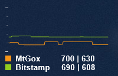

RainyBitcoin
============

BTC Ticker and historical line graph for Rainmeter. Currently supports MtGox and Bitstamp.

### Installation
- Copy RainyBitcoin dir to your Rainmeter skins folder. (C:\Users\Your Username\My Documents\Rainmeter\Skins)
- Edit Options.inc to your liking
- Enjoy your frontrow seat to panic selling tactics.

### Preview Screenshots
#### Basic

#### Minimal

#### Graph
